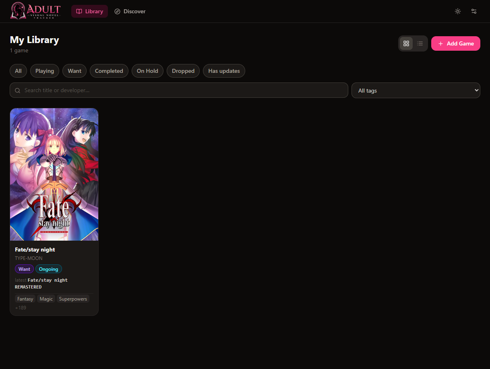
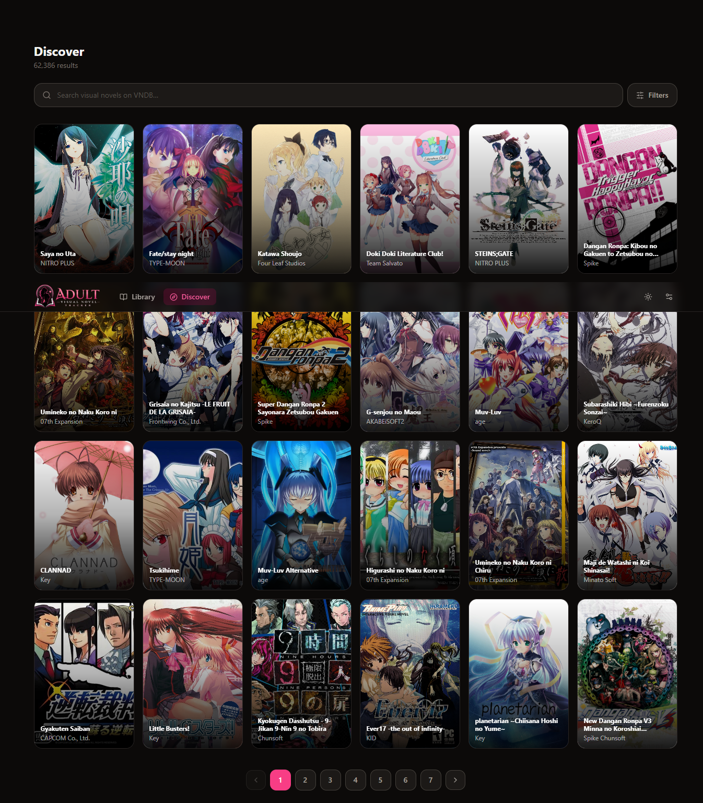
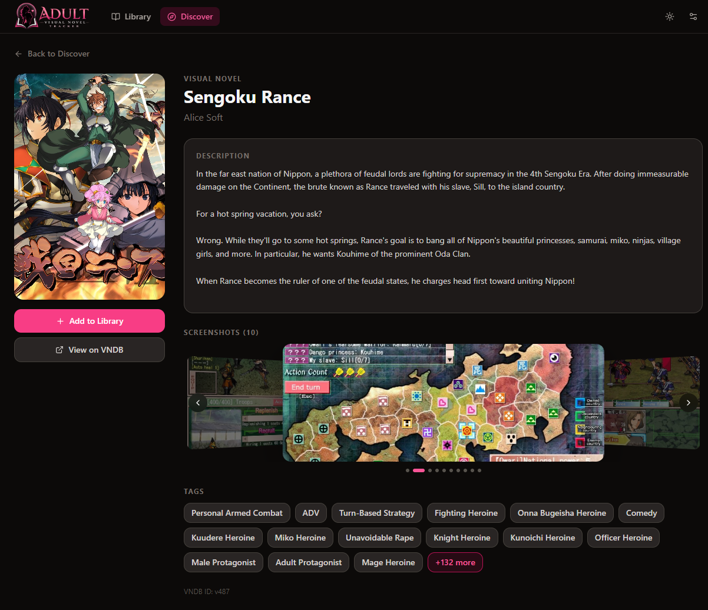
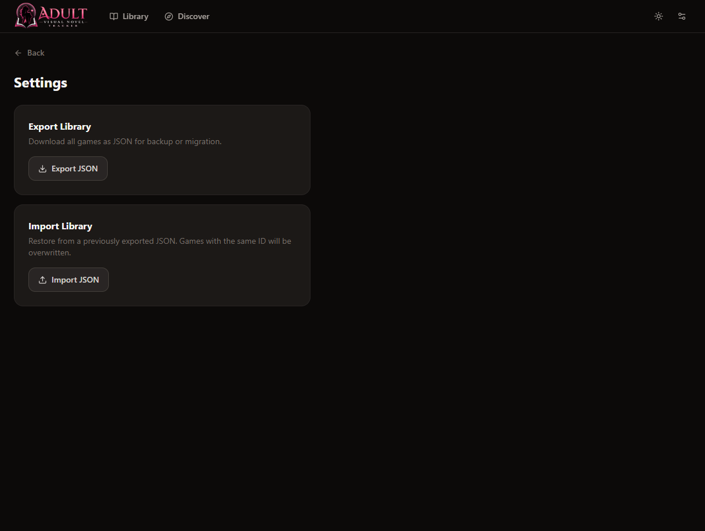

<div align="center">


# Adult Visual Novel Tracker

**A self-hosted, privacy-first library manager for adult visual novels.**
Track games, monitor version updates, and discover new titles — all without leaving your machine.

[](LICENSE) [](https://github.com/rleite-it/avn-tracker/actions/workflows/test.yml) [](https://github.com/rleite-it/avn-tracker/actions/workflows/test.yml) [](https://go.dev) [](https://react.dev) [](https://www.typescriptlang.org) [](https://docs.docker.com/compose/) [](https://www.postgresql.org) [](https://gqlgen.com)

> **Runs entirely on your machine via Docker. No accounts. No cloud. No data leaves your system.**

[Features](#features) · [Quick Start](#quick-start) · [Tech Stack](#tech-stack) · [Development](#development-setup) · [API](#graphql-api) · [Contributing](#contributing)

</div>

---

## Features

<table>
<tr>
<td width="50%">

### 📚 Library Management

- Add games manually or import directly from [VNDB](https://vndb.org)
- Track play status: **Playing · Want · Completed · On Hold · Dropped**
- Track developer status: **Ongoing · Complete · Abandoned**
- Store cover art, download links, tags, notes, and descriptions
- Grid view and list view with persistent preference

</td>
<td width="50%">

### 🔔 Version Tracking

- Record the version you last played vs. the latest known release
- Visual update badge when a newer version is available
- One-click sync to pull the latest release from VNDB
- Smart version extraction from VNDB release titles

</td>
</tr>
<tr>
<td>

### 🔍 Discover

- Browse popular visual novels from VNDB in real time
- Debounced live search — no button required
- Adult-only filter (18+ toggle, enabled by default)
- Pagination with page navigation
- In-app VN detail pages with description, screenshots, and tags

</td>
<td>

### ⚙️ Everything Else

- Light and dark theme with toggle (warm stone palette)
- Screenshot gallery with lightbox on game detail pages
- Export library to JSON for backup
- Import JSON to restore or migrate
- VNDB rate limiting + response cache to respect API usage policy

</td>
</tr>
</table>

---

## Screenshots

<div align="center">

| Library (grid view) | Discover |
|:---:|:---:|
|  |  |

| Game Detail | Settings |
|:---:|:---:|
|  |  |

</div>

---

## Tech Stack

<div align="center">

|                                                          Layer                                                          | Technology                                              |
| :---------------------------------------------------------------------------------------------------------------------: | :------------------------------------------------------ |
|                     | Component-based SPA with React 19 + Vite 6              |
|         | Full type safety across the frontend                    |
|  | Utility-first styling with warm theme + dark mode       |
|       | GraphQL client with caching                             |
|                            | High-performance GraphQL API (gqlgen, code-first)       |
|                  | Typed API contract between frontend and backend         |
|      | Persistent storage via pgx/v5 (raw SQL, no ORM)         |
|             | One-command local deployment                            |
|                                                 | Open-source VN database — metadata, covers, screenshots |

</div>

---

## Quick Start

> **Only Docker Desktop is required.** No Go, Node.js, or PostgreSQL needed locally.

```bash
# Clone
git clone https://github.com/rleite-it/avn-tracker.git
cd avn-tracker

# Configure credentials (edit POSTGRES_PASSWORD to something strong)
cp .env.example .env          # Linux / macOS
copy .env.example .env        # Windows

# Start everything
docker compose up --build -d

# Open the app
open http://localhost:3001     # Linux / macOS
start http://localhost:3001   # Windows
```

First run pulls base images and builds both containers — allow 2–5 minutes. Subsequent starts use cached layers and are near-instant.

### Default ports

| Service                      | URL                   |
| ---------------------------- | --------------------- |
| **App** (frontend)           | http://localhost:3001 |
| **GraphQL API + Playground** | http://localhost:8080 |
| PostgreSQL                   | `localhost:5432`      |

> If port `3001` is taken, change the left side of `"3001:80"` in `docker-compose.yml` to any free port.

---

## Stopping / Restarting

```bash
# Stop (data persists in Docker volume)
docker compose down

# Stop + wipe all data
docker compose down -v

# Rebuild after code changes
docker compose up --build -d
```

---

## Project Structure

```
avn-tracker/
├── docker-compose.yml
│
├── backend/                             # Go GraphQL API
│   ├── Dockerfile
│   ├── go.mod
│   ├── gqlgen.yml                       # gqlgen code-gen config
│   ├── cmd/server/main.go               # HTTP server entry point
│   └── internal/
│       ├── database/
│       │   ├── db.go                    # pgx connection pool
│       │   └── migrations/
│       │       └── 001_init.up.sql      # schema — runs automatically on startup
│       ├── graph/
│       │   ├── schema.graphqls          # ⭐ GraphQL schema (source of truth)
│       │   ├── resolver.go              # root resolver (dependency injection)
│       │   ├── schema.resolvers.go      # query + mutation implementations
│       │   └── generated/               # gqlgen output — do not edit
│       ├── model/models_gen.go          # gqlgen-generated Go structs
│       ├── repository/game_repo.go      # all SQL CRUD operations
│       └── vndb/client.go              # ⭐ VNDB API client (rate limiter + cache)
│
└── frontend/                            # React SPA
    ├── Dockerfile
    ├── nginx.conf                       # production nginx (proxies /graphql)
    ├── index.html
    ├── vite.config.ts                   # Tailwind v4 via @tailwindcss/vite
    └── src/
        ├── App.tsx                      # Apollo + Router + Nav + theme toggle
        ├── components/
        │   ├── FilterBar.tsx            # status pills + search + tag filter
        │   ├── GameCard.tsx             # grid card component
        │   ├── GameModal.tsx            # add/edit form (react-hook-form)
        │   ├── GameRow.tsx              # list row component
        │   ├── UpdateBadge.tsx          # update available indicator
        │   └── VNDBSearchInline.tsx     # VNDB search inside add-game modal
        ├── graphql/
        │   ├── queries.ts               # Apollo gql query definitions
        │   └── mutations.ts             # Apollo gql mutation definitions
        ├── pages/
        │   ├── Discover.tsx             # VNDB browse + search + pagination
        │   ├── GameDetail.tsx           # library game detail + screenshot gallery
        │   ├── Library.tsx              # main library (grid/list)
        │   ├── Settings.tsx             # export / import JSON
        │   └── VNDBGameDetail.tsx       # VNDB game detail (not yet in library)
        └── types/game.ts                # TypeScript interfaces + status colour maps
```

---

## Development Setup

Run backend and frontend separately for hot-reload during development.

### Backend

```bash
# Requires Go 1.25+ and a running PostgreSQL instance

cd backend

# Set the connection string (use the values from your .env)
export DATABASE_URL="postgres://<user>:<password>@localhost:5432/avn_tracker?sslmode=disable"
# PowerShell: $env:DATABASE_URL = "postgres://..."

# Start the API server (auto-runs migrations, playground at :8080)
go run ./cmd/server
```

### Frontend

```bash
# Requires Node.js 20+
cd frontend
npm install
npm run dev   # http://localhost:5173 — proxies /graphql to :8080
```

### Regenerating GraphQL code

Required after any change to `schema.graphqls`:

```bash
cd backend
go run github.com/99designs/gqlgen generate
```

---

## Environment Variables

Credentials and config are kept in a `.env` file (gitignored). Copy the template and edit before first run:

```bash
cp .env.example .env   # then open .env and set POSTGRES_PASSWORD
```

| Variable            | Example value   | Description                              |
| ------------------- | --------------- | ---------------------------------------- |
| `POSTGRES_DB`       | `avn_tracker`   | PostgreSQL database name                 |
| `POSTGRES_USER`     | `avn`           | PostgreSQL username                      |
| `POSTGRES_PASSWORD` | `change_me`     | PostgreSQL password — **change this**    |
| `PORT`              | `8080`          | API server port (set inside docker-compose) |

The `DATABASE_URL` passed to the API container is constructed automatically from the three `POSTGRES_*` variables in `docker-compose.yml`.

> ⚠️ Never commit your `.env` file. It is listed in `.gitignore` and excluded from version control.

---

## GraphQL API

The GraphQL playground is available at **http://localhost:8080** when running.

### Example queries

```graphql
# Get library games with filters
query {
  games(filter: { status: PLAYING, hasUpdate: true }) {
    id
    title
    myVersion
    latestVersion
    hasUpdate
  }
}

# Search VNDB in real time
query {
  searchVNDB(query: "milfy city", page: 1, adultsOnly: true) {
    results {
      vndbId
      title
      developer
      coverUrl
      screenshots {
        thumbnail
        url
      }
    }
    count
    more
  }
}

# Get full VNDB game details (screenshots, description, tags)
query {
  getVNDBGame(vndbId: "v17") {
    title
    description
    tags
    screenshots {
      thumbnail
      url
    }
  }
}
```

### Example mutations

```graphql
# Import game from VNDB (auto-fills metadata)
mutation {
  importFromVNDB(vndbId: "v17") {
    id
    title
    latestVersion
  }
}

# Sync latest release version
mutation {
  syncLatestVersion(id: "uuid") {
    latestVersion
    hasUpdate
  }
}

# Export full library as JSON
mutation {
  exportLibrary
}
```

---

## VNDB API & Rate Limits

This project uses the [VNDB Kana API](https://api.vndb.org/kana) — free and public, no authentication required.

**VNDB's limits:** 200 requests / 5 minutes · requests aborted after 3 seconds server-side.

| Protection                | Implementation                                                   |
| ------------------------- | ---------------------------------------------------------------- |
| Token bucket rate limiter | `golang.org/x/time/rate` — 0.5 req/sec avg (150/5 min), burst 10 |
| Response cache            | Search results: 3 min TTL · VN detail: 15 min TTL                |
| Stale-on-error fallback   | Returns expired cache on 429 or network error                    |
| Frontend debounce         | 700 ms after last keystroke before firing search                 |

All VNDB data is used per their [Data License](https://vndb.org/d17).

> **Adult content filter:** The discover page uses VNDB tag `g23` (Sexual Content). If results seem off, verify the tag at [vndb.org/g23](https://vndb.org/g23) and update `adultsOnlyTagID` in `backend/internal/vndb/client.go`.

---

## Data Persistence

Game data lives in a named Docker volume (`avn_tracker_postgres_data`). It survives container restarts and rebuilds.

```bash
# Backup
docker exec avn-tracker-db-1 pg_dump -U avn avn_tracker > backup.sql

# Restore
cat backup.sql | docker exec -i avn-tracker-db-1 psql -U avn avn_tracker
```

The in-app **Settings → Export** produces a portable JSON snapshot that can be imported on any AVN Tracker instance.

---

## Contributing

Contributions are welcome. Please **open an issue first** for any significant change so we can align on approach.

```bash
git clone https://github.com/rleite-it/avn-tracker.git
cd avn-tracker
cp .env.example .env   # configure credentials
docker compose up --build -d
```

### Code style

- **Backend:** `gofmt` + `go vet ./...` before submitting
- **Frontend:** TypeScript strict mode — run `npx tsc --noEmit` before submitting
- **Commits:** Conventional commits preferred (`feat:`, `fix:`, `chore:`, `docs:`)

### Roadmap / areas that need work

- [ ] Automatic background polling — sync all games on a schedule
- [ ] Multiple download links per game (mirrors, Patreon, itch.io)
- [ ] Personal rating / score field
- [ ] Mobile layout improvements
- [ ] User-configurable adult content tag IDs

---

## License

MIT — see [LICENSE](LICENSE).

This project is not affiliated with or endorsed by VNDB. All visual novel metadata, images, and screenshots are property of their respective creators and are fetched live from VNDB's public API.

---

<div align="center">

Built with ❤️ for the AVN community.

**[VNDB](https://vndb.org)** · **[gqlgen](https://gqlgen.com)** · **[pgx](https://github.com/jackc/pgx)** · **[Apollo](https://www.apollographql.com)** · **[Tailwind CSS](https://tailwindcss.com)** · **[Lucide](https://lucide.dev)**

</div>
